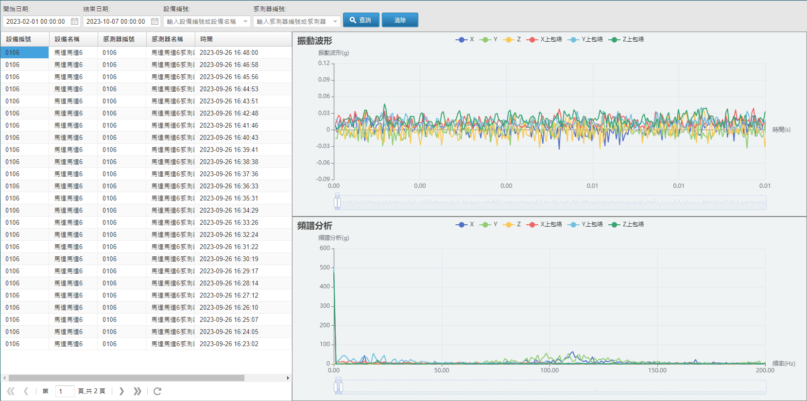

# 設備故障診斷Troubleshooting
採用無人巡檢解決方案，改善人工巡檢作業。在工廠中所有受檢設備上安裝傳感器，無論受檢設備數量多少，自動量測，定時同步回報，除了改善人工作業外，並可避免人工巡檢的缺點，更為工廠立刻帶來智能自動元素，為最快進入工業4.0 的途徑。並提供健康指數可預知維護時程，設備故障診斷使用的三軸加速規傳感器，內建計算模組，利用機器學習與人工智慧運算法，取得受檢電機正常運轉時的振動數據，以此為健康基準，再以加權運算取得該電機健康指數，精準表達預警，告警狀態。

> **加入 Facebook 社團**
>
> [https://www.facebook.com/groups/isoface/](https://www.facebook.com/groups/isoface/)
> 
> **點讚追蹤 Facebook 粉絲專頁**
> 
> [https://www.facebook.com/AIOT.ERP](https://www.facebook.com/AIOT.ERP)

監測機電設備重要核心馬達，以最清楚簡單的方式呈現當前狀態。預防設備提早老化而造成工廠生產與維運問題，確保產線維持產能與穩定度。它利用傳感器採集機電設備運行時各項參數，在設備出現故障前即時檢測出運行狀態，對將要發生的故障，發出預警訊號，並存儲所採集的大量運行數據，分秒傳輸到管理平臺進行紀錄、趨勢、分析、診斷等工作。進一步分析故障產生的原因。對故障前兆與不正常運行狀態，進行歸類分析，設置故障診斷的判斷方法。大幅改善人工作業的不便，無論受檢設備數量多少，自動量測，定時同步回報，建立成本低、並能自動預警的智慧化設備故障診斷及預警系統，為工廠引入智慧自動元素，是快速進入工業4.0 的途徑。

工廠的自動化機電設備，馬達是重要核心關鍵，能掌握馬達的健康，便能掌握60-70%的設備問題關鍵點。智慧製造中自動化設備雖然取代了人力，但機台設備不會說話，必需藉由監測系統得知設備狀態。即便是新機台設備，也不可能是完美的狀況，在運轉時都會產生一些往復式作用力於機台設備上，並有其振動產生，便藉由量測機台設備上的振動訊號，查核設備的健康狀態。

工廠內價格昂貴的馬達，往往是生產線上重要的設備，並且需要持續運作生產，這些設備需要持續監測並即時觀察。如果發生故障停機，對於產線、產品良率、損耗率、產能都將帶來很大的衝擊。所以監測馬達運行，可確保設備穩定運行。而且除了即時監測之外，還需要能自訂監控規範，提供設備保養的優先順序。

## 特色

* 提供振動頻譜資訊及原始數據，供專家進行振動診斷分析，馬達運作時發生振動的頻率代表馬達運轉狀況，當振動變大時，通常代表機械設備有故障產生，例如不平衡、對心不良、機械磨損、污垢等問題發生。就需進行振動診斷，分析故障原因。

* 全天候監測，隨時掌握設備狀態，避免發生毀滅式災害，降低工廠生產變異風險，馬達設備影響著工廠生產品質，運轉過程中，異常振動都會影響製造過程。而且產線核心設備是無法停機也需要長時間運轉，因此需長時間監控設備狀態，即時掌握設備狀態，將產線製造過程中的變異因素降到最低，確保產線順利運轉。並匯總分析數據，透過趨勢圖，預測損壞時間，作為設備保養的依據。

* 軟體操作簡單，可即時判斷狀態，隨時監看設備運轉資訊與接收告警通知系統簡單易懂，沒有技術背景，也能夠輕易瞭解馬達品質。更要即時顯示量測數據自動判讀馬達設備振動狀況，還要可以儲存所有量測歷史紀錄、建立報表等功能。當發生設備異常，需要能有告警通知，切確掌握設備狀態。

* 客製化介面支援Web、APP，採集原始數據，在戰情室提供儀表板，管理機電設備，根據工廠想要特別監測的項目製作監測項目，並提供客製化介面UI畫面，針對馬達設備提供各種監測數據，例如：溫度、電壓、頻譜、ISO規範等級、轉速品質等。讓判別結果一目瞭然，更方便使用。

* 三軸加速規傳感器，採用Modbus RTU通訊協定監測馬達設備，採用 Modbus RTU有線式感測器，監測馬達設備，不用擔心感測器停止供電、訊號收不到等困擾。

* 可隨時新增監測點，適用於成長中的企業廠房逐步擴建，擔心預算不足？佈建監測無法一次到位？廠區範圍廣大，需要監測的設備種類眾多，設備故障診斷系統，能夠依照使用者需求，按照風險等級分層找出最急迫性的設備首先著手進行監測，日後再新增擴建其他監測點也相當容易。
 
* 設備異常顯示紅燈並告警，畫面即時顯示量測結果，以燈號代表目前設備狀態，讓使用者一目瞭然。內附頻譜特徵異常對照表，幫助使用者了解馬達異常狀態原因。不用再苦等檢測人員到場，就能夠即時解決問題，當設備發生異常時，可選擇連結警報蜂鳴器或設定發送訊息即時通知。

* 內建ISO-10816規範，建立設備的健康標準，也能自訂振動規範，根據ISO振動規範定義出設備狀態，分為優良、正常、警告、危險四種等級，也可依據設備製程不同設定門檻規範，自行建立專屬設備健康的管理標準。針對不同規格的馬達設備，也有對應振動規範，不需要有複雜的技術背景，只需選擇對應的設備進行量測即可得到量測結果。

* 延長設備使用壽命，保養排程更明確，馬達設備由於價格昂貴，又加上叫料備料期較長、料件費用也不低。若能切確了解設備品質，便能夠依照設備狀態平時加強保養或避開產線運轉時間，進一步延長馬達設備的使用壽命。

* 提供健康指數可預知維護時程，使用三軸加速規傳感器，內建計算模組，利用機器學習與人工智慧運演算法，取得受檢電機正常運轉時的振動數據，以此為健康基準，再經運算取得該設備健康指數，精準表達預警，告警狀態。

## 功能明细

|基本設置| 設備即時運轉資訊|統計分析|
|---|---|---|
|設備基本資訊設定 設備運轉參數設定功能 設備告警參數設定 異常設備管理發報|圖像式之設備管理介面 可提供後台與遠端手機 即時運轉監視 頻譜圖、時域頻譜圖監測查詢|線上/斷線機電設備數 運轉正常/異常機電設備數 故障排行故障原因統計|

|告警資訊|報表資訊|裝置管理|
|---|---|---|
|提供即時告警資訊推播 歷史告警紀錄查詢 告警分析診斷|提供運轉日報表與月報表 能耗運轉統計分析表|設備增加、刪除、修改 多樣化的機電設備查詢方式 使用者權限設定|

